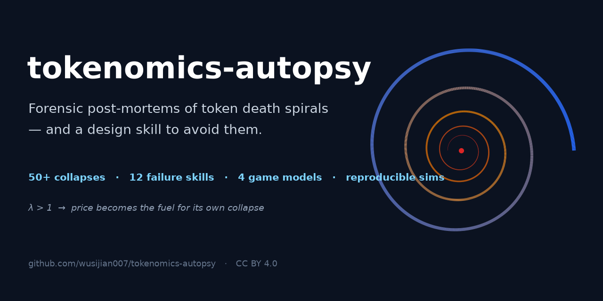

# tokenomics-autopsy

**Forensic post-mortems of 50+ token death spirals — and a design skill to avoid them.**

[](LICENSE)
[](simulations/)
[](token-collapse-analysis-2009-2026.md)
[](skills/)


> 🌐 **English** | [中文](README.zh.md) · License: [CC BY 4.0](LICENSE)

> An open-source **knowledge base for tokenomics design**: a forensic analysis of 50+ landmark collapses (2009–2026), distilled into reusable failure anti-patterns, game-theoretic models, and reproducible simulations — a design reference for future token projects.
>
> **Research / design reference, not investment advice.**

---

## Three layers

| Layer | Content | File |
|---|---|---|
| **L1 Phenomenon** — Cases | 50 collapse cases + an 8-class mechanism taxonomy, with a total-count estimate | [`token-collapse-analysis-2009-2026.md`](token-collapse-analysis-2009-2026.md) |
| **L2 Mechanism** | Unified reflexivity equation (λ>1), 4 game models, quantitative supply-demand anatomy, case-by-case breakdowns + simulation charts | [`death-spiral-deep-analysis.md`](death-spiral-deep-analysis.md) |
| **L3 Knowledge** — Skills | A triggerable open-source skill pack: 12 failure anti-patterns, a measurable risk scorecard, a full audit protocol, a survivor control group, and a 10-step design playbook | [`skills/`](skills/) |

Supporting layers:
- [`simulations/`](simulations/) — 4 calibrated, reproducible Python simulations that generate every phase-transition chart.
- [`data/`](data/) — a structured dataset of 38 cases, an 18-case scorecard calibration (10 collapses vs 8 survivors), and macro overview charts.
- [`validation/`](validation/README.md) — **out-of-sample validation**: a 15-case leakage-audited holdout backtest + a frozen prospective registry with falsifiable predictions (reviews 2027/2028).

> Chinese versions of every document are available: [中文 README](README.zh.md) · [L1 中文](加密项目代币崩溃分析_2009-2026.md) · [L2 中文](代币经济学死亡螺旋_深度分析与失败Skills.md).

---

## The core idea

A death spiral is **not bad luck or an operational error — it is an endogenous phase transition**. When the system gain

```
λ = (∂fundamentals/∂price) · (∂price/∂fundamentals) > 1
```

the token's own price becomes the fuel for the mechanism, and any downward perturbation is amplified exponentially. Healthy designs keep `λ < 1` (fundamentals decoupled from price).

**The one-line test:** *if the token's price went to zero, would anyone still need this token?* If the answer is "no," demand is reflexive and unanchored → redesign or walk away.

---

## The 12 failure Skills (quick reference)

Tiers: **engine** (creates the spiral, weight ×3) · **structure** (builds sell pressure, ×2) · **amplifier** (worsens shocks, ×1).

| # | Anti-pattern | Tier | Killer threshold |
|---|---|---|---|
| S1 | Reflexive collateral | engine | corr(reserve, liability) → 1 |
| S2 | Subsidized demand | engine | payout > revenue; reserve runway < 12 months |
| S3 | Uncapped faucet | structure | sink/faucet < 1 and the sink needs new users |
| S4 | (3,3) coordination fragility | structure | price/backing > 3; yield from inflation |
| S5 | Sequential-service redemption | engine | liquidity coverage < instantly-redeemable liabilities |
| S6 | Seigniorage absorbing barrier | engine | reserve ratio R = M/S → 1 |
| S7 | Float–FDV asymmetry | structure | initial float <10%; first-year unlock >50% of float |
| S8 | Velocity leak | amplifier | no value capture; high velocity |
| S9 | Narrative-only demand | engine | zero revenue; concentrated, unlocked holders |
| S10 | Leverage contagion | amplifier | tokens cross-collateralize; correlation → 1 in stress |
| S11 | Mercenary points / rented TVL | structure | organic TVL share <30%; snapshot/TGE cliff |
| S12 | Recursive leverage loop | structure | loop unwind size > real market depth |

Detail + antidotes: [`anti-patterns.md`](skills/tokenomics-death-spiral-audit/references/anti-patterns.md) · why survivors survived: [`survivors.md`](skills/tokenomics-death-spiral-audit/references/survivors.md)

**Calibration (in-sample)** — the scorecard was back-scored on 18 historical cases (10 collapses, 8 stress survivors). Collapses score 12–37, survivors 1–11, and **no survivor triggers an engine red line** ([`data/scorecard_calibration.py`](data/scorecard_calibration.py)):


**Validation (out-of-sample)** — 15 further cases that appear nowhere in this repo and were never used to build the instrument (leakage-audited: USDN, DEI, Tomb, StrongBlock, Titano, Solidly, Blur, Celestia vs USDT, Frax, LINK, rETH, Aave, AMPL, Pendle). The raw totals overlap in the middle band — but the **engine → structure → anchor decision rule classifies 15/15 outcomes correctly**, including the two structure-only bleeds and the stressed survivor ([`validation/`](validation/README.md)). A frozen [prospective registry](validation/prospective-registry.md) (Ethena, Hyperliquid, pump.fun, USDD, Jupiter + 2 in-flight) pre-registers falsifiable predictions for 2027/2028 review — the bias-free tier:


---

## The 4 game models

| Model | Failure shape | Watch | Simulation |
|---|---|---|---|
| Bank run (Diamond–Dybvig) | sudden | belief shock | `sim4` |
| (3,3) coordination | collapses to backing | new-money growth | `sim2` |
| Seigniorage absorbing barrier | to zero | reserve ratio R | `sim1` |
| Unlock / inflation supply glut | slow bleed | unlock calendar | `sim3` |

See [`game-models.md`](skills/tokenomics-death-spiral-audit/references/game-models.md).

---

## Quick start

**Screen a token in 15 minutes:** run the 8-question quick screen at the top of
[`audit-protocol.md`](skills/tokenomics-death-spiral-audit/references/audit-protocol.md) → `PASS` / `CONCERNS` / `RED LINE`.

**Full audit** (human or AI agent) — follow [`audit-protocol.md`](skills/tokenomics-death-spiral-audit/references/audit-protocol.md):
1. Collect inputs and draw the mechanism map (every price-dependent flow = a candidate λ>1 loop).
2. Classify the game structure with [`game-models.md`](skills/tokenomics-death-spiral-audit/references/game-models.md).
3. Measure and score the 12 rows of [`scorecard.md`](skills/tokenomics-death-spiral-audit/references/scorecard.md) (worked examples: Terra 37/54, DAI 1/54).
4. Compute distance-to-threshold, stress-test with the simulations, write the report from the template.

**Design a token** — follow the 10-step [`design-playbook.md`](skills/tokenomics-death-spiral-audit/references/design-playbook.md): necessity test → demand anchor → value capture → supply benchmarks → circuit breakers → incentives-as-CAC → liquidity plan → monitoring dashboard → pre-launch stress test → launch checklist.

**Run the simulations / regenerate charts:**
```bash
cd simulations && python -m pip install -r requirements.txt && python run_all.py
cd ../data && python case_dataset.py && python scorecard_calibration.py
```

**Use it as a Claude / Agent skill:** drop `skills/tokenomics-death-spiral-audit/` into your skills directory; it triggers automatically when you ask about token model design or sustainability.

---

## Repo layout
```
cryptofail/
├── README.md                              # this file (English)
├── README.zh.md                           # Chinese
├── token-collapse-analysis-2009-2026.md   # L1 case library (EN)  / 加密项目代币崩溃分析_2009-2026.md (ZH)
├── death-spiral-deep-analysis.md          # L2 deep analysis (EN, with charts) / 代币经济学死亡螺旋_深度分析与失败Skills.md (ZH)
├── skills/
│   ├── README.md
│   └── tokenomics-death-spiral-audit/
│       ├── SKILL.md                       # L3 skill entry point (4 modes)
│       └── references/{anti-patterns,game-models,scorecard,
│                       audit-protocol,survivors,design-playbook,simulations}.md
├── simulations/
│   ├── sim1..sim4_*.py, run_all.py, viz.py, requirements.txt
│   └── charts/*.png
├── data/
│   ├── case_dataset.py / case_dataset.csv              # 38 collapse cases
│   └── scorecard_calibration.py / scorecard_calibration.csv   # 18-case in-sample calibration
└── validation/
    ├── README.md                                       # OOS protocol + freeze record
    ├── holdout_backtest.py / holdout_backtest.csv      # 15 leakage-audited held-out cases
    └── prospective-registry.md / registry_scores.csv   # frozen predictions (reviews 2027/2028)
```

## Contributing
New cases, corrections, simulations, and translations are all welcome — see
[CONTRIBUTING.md](CONTRIBUTING.md). The bar is correctness and clear mechanism mapping.

## License
CC BY 4.0. Community contributions of new cases and models are welcome. Figures are order-of-magnitude estimates; reconcile against live data. Some named cases are in ongoing litigation — defer to final rulings.
