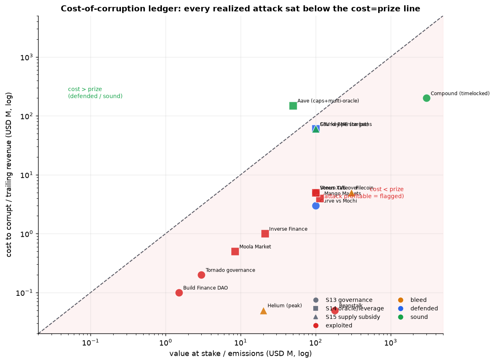

# Tokenomics Soundcheck

> **健全的货币,需要健全的机制。** _Sound money needs sound mechanisms._

**设计不会为自身崩塌供能的代币经济——并在上线前压力测试它。**
Design token economies that don't fuel their own collapse — and stress-test them before they launch.

[](LICENSE)
[](simulations/)
[](加密项目代币崩溃分析_2009-2026.md)
[](skills/)


> [English](README.md) | 🌐 **中文** · 许可:[CC BY 4.0](LICENSE)

> 一个开源的代币经济学**避坑知识库**:从 2009–2026 的 50+ 个标志性崩盘中,蒸馏出可复用的失败反模式、博弈论模型与可复现仿真,供未来代币项目作设计参考。
> An open-source knowledge base for tokenomics design: forensic analysis of 50+ landmark collapses distilled into reusable anti-patterns, game-theoretic models, and reproducible simulations.
>
> **研究 / 设计参考,非投资建议。** Research / design reference, **not investment advice.**

---

## 三层结构 / Three layers

| 层 | 内容 | 文件 |
|---|---|---|
| **L1 现象层** Cases | 50 个崩盘案例 + 8 类机制分类,总量估算 | [`加密项目代币崩溃分析_2009-2026.md`](加密项目代币崩溃分析_2009-2026.md) |
| **L2 机制层** Mechanisms | 统一反身性方程(λ>1)、4 个博弈模型、供需定量解剖、逐案拆解 + 仿真图 | [`代币经济学死亡螺旋_深度分析与失败Skills.md`](代币经济学死亡螺旋_深度分析与失败Skills.md) |
| **L3 知识层** Skills | 可触发的开源 skill pack:评估侧 = 15 个失败反模式(12 螺旋 + 3 经济攻击)+ 可测量评分卡 + 腐化成本安全面板 + 审计协议;设计侧 = 16 个正向机制模式库 + 8 个赛道 playbook + 流动性/循环经济/激励深潜文档 | [`skills/`](skills/) |

支撑层 / Supporting:
- [`simulations/`](simulations/) — 8 个校准过的可复现 Python 仿真(6 个失败原型 + sim7 PID 阻尼稳定 + sim8 spender-class 经济)。
- [`data/`](data/) — 38 案例数据集 + 18 案例评分卡校准 + 腐化成本安全面板回测(S13/S14/S15)+ 53 案例评分宇宙与经验权重拟合。
- [`validation/`](validation/README.md) — **out-of-sample 验证**:15 案例泄漏审计留出集回测 + 冻结的前瞻性预注册登记册(2027/2028 复核)+ 红队程序。
- [`tools/`](tools/README.md) — 产品层:stress-runner(设计规格 → 结论)、报告生成器、κ 与登记册监控工具。

---

## 核心洞见 / The core idea

死亡螺旋**不是运气或运营失误,而是机制内生的相变**。当系统增益

```
λ = (∂fundamentals/∂price) · (∂price/∂fundamentals) > 1
```

时,代币价格本身成为机制的燃料,任何向下扰动被指数放大。健康设计保持 `λ < 1`(基本面与价格解耦)。

**一句话判据**:*如果币价归零,还有人需要这个代币吗?* 答"否" = 需求反身、无锚 → 重新设计或不做。

---

## 15 个失败 Skills(速查)/ The 15 failure Skills

两个轴。**螺旋风险**(S1–S12,0–54 分)——放大下跌的反身性动力学;分层 **引擎**(×3)· **结构**(×2)· **放大器**(×1)。**攻击风险**(S13–S15,独立安全面板)——代码没错、机制被定价错的离散攻击。

| # | 反模式 | 层级 | 致命阈值 |
|---|---|---|---|
| S1 | 反身性抵押 Reflexive collateral | 引擎 | corr(储备, 负债) → 1 |
| S2 | 补贴需求 Subsidized demand | 引擎 | 支出 > 收入;储备 runway < 12 月 |
| S3 | 无上限龙头 Uncapped faucet | 结构 | sink/faucet < 1 且 sink 靠新用户 |
| S4 | (3,3) 协调脆性 | 结构 | 市价/背书 > 3;收益靠增发 |
| S5 | 银行挤兑结构 Sequential redemption | 引擎 | 流动性覆盖 < 可即时赎回负债 |
| S6 | 算稳吸收壁垒 Absorbing barrier | 引擎 | 储备率 R = M/S → 1 |
| S7 | 低流通高 FDV | 结构 | 初始流通 <10%;首年解锁 >50% |
| S8 | 速度漏损 Velocity leak | 放大器 | 无价值捕获;高 velocity |
| S9 | 纯叙事需求 Narrative-only | 引擎 | 零收入;持仓集中;名人未锁 |
| S10 | 杠杆传染 Leverage contagion | 放大器 | 互为抵押;危机中相关性→1 |
| S11 | 雇佣兵积分 / 租来的 TVL | 结构 | 有机 TVL 占比 <30%;快照/TGE 悬崖 |
| S12 | 递归杠杆循环 Recursive loop | 结构 | 平仓规模 > 真实市场深度 |
| S13 | 可捕获治理 Captureable governance | 攻击面 | 腐化法定人数成本 < 其掌控价值;无时间锁 |
| S14 | 可操纵预言机杠杆 | 攻击面 | 移动预言机成本 < 可借出价值 |
| S15 | 供给侧补贴错配(DePIN) | 结构 | 服务收入 / 排放价值 ≪ 1 |

详解 + 解药:[`anti-patterns.md`](skills/tokenomics-soundcheck/references/anti-patterns.md) · 腐化成本账本(S13–S15):[`economic-security.md`](skills/tokenomics-soundcheck/references/economic-security.md) · 幸存者为何幸存(对照组):[`survivors.md`](skills/tokenomics-soundcheck/references/survivors.md)

**经济攻击轴** — "代码按写的执行"不是防御:Beanstalk(治理)和 Mango(预言机)都是**购买**而非黑客。对每个已知经济攻击回测可见,利润不等式(`可提取价值 − 腐化成本 > 0`)在攻击**之前**就可计算([`data/security_panel.py`](data/security_panel.py)):



**校准(in-sample)** — 评分卡在 18 个历史案例上回测(10 个崩盘 + 8 个压力幸存者):崩盘组 12–37 分,幸存组 1–11 分,**没有任何幸存者触发引擎红线**([`data/scorecard_calibration.py`](data/scorecard_calibration.py)):


**验证(out-of-sample)** — 另取 15 个在本库中从未出现、从未参与工具构建的案例(泄漏审计:USDN、DEI、Tomb、StrongBlock、Titano、Solidly、Blur、Celestia vs USDT、Frax、LINK、rETH、Aave、AMPL、Pendle)。原始总分在中间区间有重叠——但**引擎 → 结构 → 锚 三级判定规则 15/15 全部分类正确**,包括两个纯结构阴跌案例和一个高压幸存者([`validation/`](validation/README.md))。另有冻结的[前瞻性登记册](validation/prospective-registry.md)(Ethena、Hyperliquid、pump.fun、USDD、Jupiter + 2 个进行中案例)预注册了可证伪预测,2027/2028 复核——这是无后见之明偏差的金标准层:


**经验权重** — 在 53 案例[评分宇宙](data/scored_universe.py)上做数据驱动的逻辑回归拟合,复现了手工权重的 引擎 > 结构 > 放大器 排序([`fit_weights.py`](data/fit_weights.py))。近乎完美的 AUC 是**一致性**结果(数据集大部分是样本内),**不是**对未来的预测准确率;但拟合暴露了真实的再校准信号(该提高 S9、把 S12 当作组合项)。冻结的 v2 权重维持不变,等样本外胜出再议:


---

## 4 个博弈模型 / The 4 game models

| 模型 | 失败形态 | 看什么 | 仿真 |
|---|---|---|---|
| 银行挤兑 Diamond–Dybvig | 突变 | 信念冲击 | `sim4` |
| (3,3) 协调 | 塌到背书价 | 新钱增长率 | `sim2` |
| 算稳吸收壁垒 | 归零 | 储备率 R | `sim1` |
| 解锁/通胀供给 | 阴跌 | 解锁日历 | `sim3` |

详见 [`game-models.md`](skills/tokenomics-soundcheck/references/game-models.md)。

---

## 安装为 agent skill / Install as an agent skill

skill pack 遵循开放的 [Agent Skills](https://agentskills.io) 标准——同一个文件夹可用于 **Claude Code、Codex CLI、Cursor、Gemini CLI、Copilot、Grok Build** 等 16+ 个 agent:

```
/plugin marketplace add wusijian007/tokenomics-soundcheck        # Claude Code(Grok 也会读取)
/plugin install tokenomics-soundcheck@tokenomics-soundcheck
```

或把 `skills/tokenomics-soundcheck/` 复制进 agent 的 skills 目录(`~/.claude/skills/`、`~/.grok/skills/` …)。完全自包含:14 份参考文档 + 零依赖可运行 `scripts/`。全部安装方式(含 zip 构建与无 skill 平台的单文件 prompt pack):**[INSTALL.md](INSTALL.md)**。

## 快速开始 / Quick start

**15 分钟快筛**:用 [`audit-protocol.md`](skills/tokenomics-soundcheck/references/audit-protocol.md) 开头的 8 问快筛 → `PASS` / `CONCERNS` / `RED LINE`。

**完整审计**(人类或 AI agent)— 按 [`audit-protocol.md`](skills/tokenomics-soundcheck/references/audit-protocol.md) 走:
1. 收集输入,画机制图(每条依赖币价的流 = 候选 λ>1 回路)。
2. 用 [`game-models.md`](skills/tokenomics-soundcheck/references/game-models.md) 归类博弈结构。
3. 按 [`scorecard.md`](skills/tokenomics-soundcheck/references/scorecard.md) 的测量方法给 12 行打分(实例:Terra 37/54,DAI 1/54)。
4. 计算距阈值距离,用仿真压测,按模板出报告。

**设计一个代币** — 走 10 步 [`design-playbook.md`](skills/tokenomics-soundcheck/references/design-playbook.md)(必要性 → 需求锚 → 价值捕获 → 供给基准 → 熔断器 → 激励即获客成本 → 流动性 → 监控 → 压测 → 上线),在 [`archetype-playbooks.md`](skills/tokenomics-soundcheck/references/archetype-playbooks.md) 里选你的赛道,用 [`design-patterns.md`](skills/tokenomics-soundcheck/references/design-patterns.md) 的 16 个正向机制搭建——配 [流动性](skills/tokenomics-soundcheck/references/liquidity-engineering.md)、[循环经济](skills/tokenomics-soundcheck/references/circular-economy.md)、[激励](skills/tokenomics-soundcheck/references/incentive-audit.md) 三份深潜文档。

**当作工具跑** — [`tools/`](tools/README.md) 把清单变成代码:
```bash
cd tools
python stress_runner.py design.example.yaml     # 设计规格 → 打分 + step-9 结论
python report_generator.py audit.example.json   # 完成的审计 → 完整 markdown 报告
```
stress-runner 把设计规格在全部 12 螺旋行 + 安全面板上打分、跑对应仿真、输出结论(附带的 Terra 式 `design.badexample.yaml` 得 42/54、5 条引擎红线、REDESIGN)。

**跑仿真 / 生成图表:**
```bash
cd simulations && python -m pip install -r requirements.txt && python run_all.py
cd ../data && python case_dataset.py && python scorecard_calibration.py && python security_panel.py && python scored_universe.py && python fit_weights.py
```

**作为 Claude / Agent skill 使用:** 把 `skills/tokenomics-soundcheck/` 放进 skills 目录,询问代币模型设计/可持续性时会自动触发。

---

## 目录树 / Repo layout
```
cryptofail/
├── README.md                                  # 本文件
├── 加密项目代币崩溃分析_2009-2026.md            # L1 案例库
├── 代币经济学死亡螺旋_深度分析与失败Skills.md     # L2 深度分析(含仿真图)
├── skills/
│   ├── README.md
│   └── tokenomics-soundcheck/
│       ├── SKILL.md                           # L3 skill 入口(4 种模式;可安装,见 INSTALL.md)
│       ├── scripts/                           # 捆绑的零依赖 stress-runner + 报告生成器
│       └── references/{anti-patterns,game-models,scorecard,economic-security,
│                       audit-protocol,survivors,design-playbook,design-patterns,
│                       archetype-playbooks,liquidity-engineering,circular-economy,
│                       incentive-audit,lambda-formalization,simulations}.md
├── simulations/
│   ├── sim1..sim8_*.py(6 失败 + sim7 PID + sim8 spender-class), run_all.py, viz.py
│   └── charts/*.png
├── tools/                                          # v6 产品层
│   ├── stress_runner.py + design.example.yaml      # 设计规格 → 打分结论
│   ├── report_generator.py + audit.example.json    # 审计 → markdown 报告
│   ├── kappa_reliability.py                         # 评分者间信度 κ(E3)
│   └── registry_monitor.py + registry_metrics.example.json
├── data/
│   ├── case_dataset.py / .csv                           # 38 个崩盘案例
│   ├── scorecard_calibration.py / .csv                  # 18 案例 in-sample 校准
│   ├── security_panel.py / .csv                         # 腐化成本回测(S13/S14/S15)
│   ├── scored_universe.py / .csv                        # 53 案例统一评分集
│   └── fit_weights.py / weight_fit.csv                  # 经验权重拟合(手工 vs 数据)
├── ROADMAP.md                                           # 前沿差距分析 + v4→v6 计划
└── validation/
    ├── README.md                                        # OOS 协议 + 经验权重 + 冻结记录
    ├── holdout_backtest.py / .csv                        # 15 个泄漏审计留出案例
    ├── prospective-registry.md / registry_scores.csv    # 冻结预测(2027/2028 复核)
    └── red-team.md                                       # "打破工具"常设挑战
```

## 研究议程 / Research agenda
项目的下一步:横跨激励经济学、机制设计、流动性工程、循环经济、估值与加密经济安全的前沿差距分析,以及 v4→v6 路线图:[ROADMAP.md](ROADMAP.md)。

## 许可 / License
CC BY 4.0。欢迎社区贡献新案例与新模型。数字为量级估算,请以实时数据为准;部分案例仍在诉讼中,定性以最终司法结论为准。
