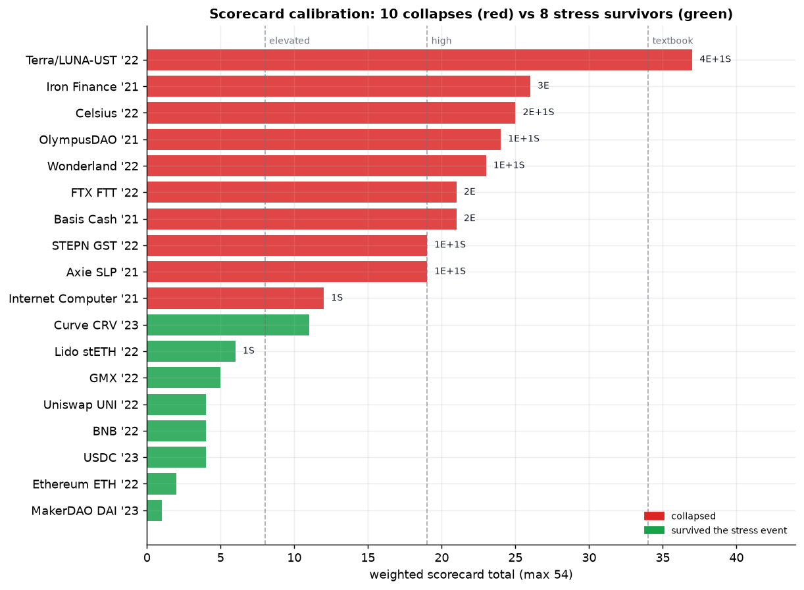
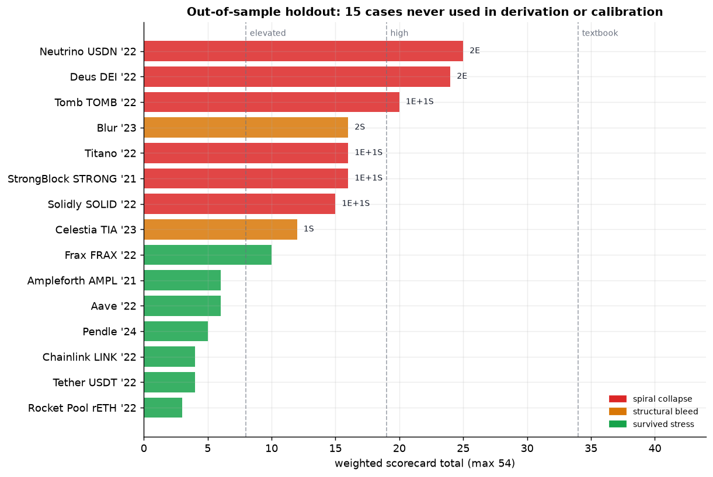

# Tokenomics Death Spirals: Game Theory / Supply-Demand Deep Analysis & Failure-Skill Distillation

> 🌐 **English** | [中文](代币经济学死亡螺旋_深度分析与失败Skills.md)
>
> Companion document: [Token Collapse Analysis 2009–2026](token-collapse-analysis-2009-2026.md) (the case-catalog layer).
> This is the **mechanism layer**: it upgrades "which projects collapsed" into "why they were mathematically and game-theoretically bound to collapse," and distills the findings into reusable design anti-patterns (failure Skills).
> Scope: research / design reference, not investment advice. All figures are order-of-magnitude estimates used to illustrate mechanisms, not to reconstruct prices precisely.

---

## 0. Methodology: a three-layer framework

The case catalog answers "**what** (which projects collapsed)"; this document answers "**why-inevitable**" and "**how-to-apply**." Three ascending layers:

| Layer | Question | Output | Case file | This doc |
|---|---|---|---|---|
| L1 Phenomenon | which projects collapsed, by how much | case library | ✅ 50 cases | references |
| L2 Mechanism | why the supply-demand/game structure was bound to collapse | models + quantitative anatomy | ❌ | ✅ core of this doc |
| L3 Knowledge | how to detect and avoid it at design time | anti-pattern Skills + scorecard | ❌ | ✅ chapters 5–6 |

**Key claim**: a death spiral is not "bad luck" or "operational error" but an **endogenous phase transition**. Above a critical parameter the system sits in one stable attractor; once it crosses the threshold it jumps to another attractor (→ 0). The real analytical goal is to find **that critical condition** for each class of mechanism.

---

## 1. The unified mathematical structure of a death spiral: reflexivity = positive feedback

### 1.1 Normal market vs death spiral: opposite feedback signs

A healthy asset's supply-demand is **negative feedback (self-stabilizing)**:

```
price ↑ → demand ↓ / supply ↑ → price falls back   (negative feedback, converges to equilibrium)
```

A death-spiral asset is re-engineered by its mechanism into **positive feedback (self-reinforcing)**:

```
price ↓ → mechanism forced to mint/dump/liquidate/redeem → supply ↑ / demand ↓ → price ↓↓   (positive feedback, diverges)
```

Capture this with a unified reflexivity equation (a discretization of Soros reflexivity):

```
P(t+1) = P(t) · [1 + g(P(t), F(t))]
F(t+1) = F(t) · [1 + h(P(t))]        ← key: fundamentals F depend back on price P
```

- In a **healthy project**, `∂h/∂P ≈ 0`: fundamentals (real revenue, real utility) are independent of token price.
- In a **death-spiral project**, `∂h/∂P > 0` and large enough: fundamentals are designed to depend on price (collateral is the token itself, demand is an APY, rewards depend on newcomers), so P and F feed each other.

**Critical condition (the through-line of this document):** when the system gain `λ = (∂g/∂F)·(∂h/∂P) > 1`, the equilibrium turns from "stable" into an "unstable saddle," and any downward perturbation is amplified exponentially → death spiral. **All A/B/C-class projects essentially design λ to be > 1.**

### 1.2 Two kinds of phase transition: continuous vs sudden

| Type | Dynamics | Price path | Trigger | Examples |
|---|---|---|---|---|
| **Sudden (run)** | multiple equilibria + belief jump | cliff over hours–days | confidence shock (sunspot) | Terra, FTX, Celsius, Iron/TITAN |
| **Continuous (bleed)** | single unstable equilibrium + persistent sell pressure | months–years deflation | unlocks/inflation realized daily | ICP, FIL, WLD, SLP, GST |

The sudden type is a "belief-coordination failure"; the continuous type is a "supply curve marching right." Their red flags are detected differently (see chapter 5).

---

## 2. The four core game-theoretic models

There are only 4 recurring game structures behind death spirals. Master these 4 and you can rapidly classify any new project.

### 2.1 Bank-run game (Diamond–Dybvig) — the sudden type

**Structure**: the protocol promises **instant, full, first-come-first-served** redemption (a sequential-service constraint), but the underlying assets are **illiquid / maturity-mismatched / price-sensitive**.

A depositor (token holder) being patient or impatient is unknown. The payment game has **two pure-strategy Nash equilibria**:

| Equilibrium | Everyone chooses | Outcome | Stability |
|---|---|---|---|
| Good | don't run | protocol fine, all repaid with interest | fragile (belief-held) |
| Bad | run | assets fire-sold, latecomers get zero | self-locking once entered |

**Best response**: as long as you **believe others will run**, your dominant strategy is to **run first** (the first-mover advantage is positive). Hence the bad equilibrium is **self-fulfilling** — it doesn't need fundamentals to actually deteriorate, only a belief jump.

- **Trigger (sunspot)**: CoinDesk exposing the Alameda balance sheet (FTX), UST slightly de-pegging in a Curve pool (Terra), withdrawal-pause rumors (Celsius). These may be mere noise, yet they ignite the coordination failure.
- **Design root cause**: ① sequential service (FCFS) creates a first-mover advantage; ② maturity/liquidity mismatch; ③ a promise of instant redemption. All three present = a run incubator.
- **Antidote (remove the first-mover advantage)**: redemption queues / lockups, **pro-rata payouts instead of FCFS** (eliminating front-running gains), liquidity coverage > instantly-redeemable liabilities, circuit breakers.

> Applies to: FTX (FTT), Celsius, Voyager, Iron Finance, the Anchor withdrawal wave, all CeFi lending.

### 2.2 The (3,3) coordination game — actually a prisoner's dilemma dressed as cooperation

OlympusDAO's "(3,3)" draws a payoff matrix saying "both staking is best (3,3)," luring cooperation. But it hides **where the payoff comes from**: the high staking APY comes from **minting** (dilution) + **new bond buyers funding the treasury**. The real two-player game (existing holder vs marginal participant) is:

```
                  other STAKES         other SELLS
   I STAKE      (nominal+, real value   (I'm diluted, they  ← I lose
                 depends on new money)    cash out)
   I SELL       (I cash out, they bag-hold)  (joint stampede, premium → backing)
```

**Key**: APY is nominal (rebase gives you more units), but your **real share = your tokens / total supply** is being diluted by inflation. Staking only pays when **new-capital inflow ≥ dilution rate**. This is equivalent to a **finite-horizon game of musical chairs**:

- **Backward induction**: there exists a "last buyer" with no one left to sell to → he shouldn't buy → the second-to-last anticipates this and shouldn't either → rationally it should unravel from the end. In reality it's sustained by a "greater fool" belief + an infinite-horizon assumption, until **new-capital growth < redemption rate** and the music stops.
- **Observable critical quantity**: `premium = market price / treasury backing (backing/RFV)`. OHM was once > 100×; after belief reversed it collapsed back to ~1× (note: it collapses back to **backing, not zero** — this distinguishes it from algo-stables).
- **Antidote**: make payouts come from **real protocol revenue** rather than minting; reduce the advantage of "staying" over "exiting" (symmetrize); publish backing and don't encourage premium speculation.

> Applies to: OHM and all its forks (Wonderland/TIME, Klima, Hector, dozens of "DAOs").

### 2.3 Algo-stablecoin mint/burn arbitrage and the "absorbing barrier" — the seigniorage death spiral

Dual-token mint/burn (Terra LUNA↔UST, Iron TITAN↔IRON, Basis, ESD) maintains the peg via arbitrage:

```
UST < $1:  burn 1 UST → mint $1 worth of LUNA (then sell)  → reduces UST supply, pulls peg back
UST > $1:  burn $1 worth of LUNA → mint 1 UST              → increases UST supply
```

The peg is self-consistent in a bull market. The fatal point is **downward arbitrage**: it **converts UST selling pressure into LUNA minting pressure**.

**Solvency condition (the core formula)**: let UST supply be `S`, LUNA market cap `M = P_luna · Q_luna`. Full redemption requires minting `S` worth of LUNA. The system can absorb this only if:

```
reserve-adequacy ratio  R = M / S  ≫ 1
```

- At peak, LUNA market cap ~$40B, UST ~$18B, `R ≈ 2.2` — **looks safe**.
- But `M` is **reflexive**: redemptions → mint and dump LUNA → `P_luna ↓` → `M ↓` → `R ↓` → more panic → more redemptions. This is exactly §1.1's `λ>1`.
- When `R → 1` and below, **full redemption is mathematically impossible without crashing LUNA to zero**. This is an **absorbing barrier**: once crossed, no matter how subsequent play unfolds, the terminal state is unique = LUNA → 0, UST de-peg permanent. Terra crossed the absorbing barrier from `R≈2` in ~72 hours.

**Why even a circuit breaker can't save it (the Terra lesson)**: even with a daily mint cap (Terra's was ~$293M/day at the time), rate-limiting only **stretches out** the redemptions, and in fact prolongs the panic window and worsens de-peg expectations — rate-limiting treats the symptom, not the root cause, which is that **the collateral is the reflexive asset itself**.

- **Antidote**: ① collateral that is **exogenous and de-correlated from the liability** (USDC/ETH, not the native token); ② overcollateralization + a reserve-adequacy **circuit breaker** (pause mint/burn and switch to partial collateral once R hits the line); ③ abandon the "algorithmic + native token" combination altogether.

> Applies to: Terra (LUNA/UST), Iron Finance (TITAN/IRON), Basis Cash, Empty Set Dollar.

### 2.4 The sequential / information-asymmetry game of unlock pressure — the continuous bleed

Low-float high-FDV projects (ICP, FIL, WLD, APE) are not a run but a multi-period game of a **structural supply-curve shift to the right**.

**Marginal-seller vs marginal-buyer cost-basis asymmetry** (the root cause):

```
marginal seller = insiders (VC/team), cost basis ≈ $0 → reservation price ≈ 0, willing to sell at any positive price
marginal buyer  = secondary retail, cost basis = market → needs a narrative / upside expectation to bid
```

Every unlock injects a batch of **~zero-cost-basis supply** into the market. Before demand can absorb it, the clearing price is set by the **lowest-reservation-price seller** → price is continuously pushed toward the insiders' cost basis.

**Add information asymmetry**: insiders know the true unlock calendar, true retention, true treasury usage; retail only sees the chart. This is an **Akerlof lemon market** — rational retail should discount for the "invisible future unlocks," but the bull narrative makes them systematically underestimate supply, until the unlocks are realized month by month.

- **Observable critical quantities**: `initial float ratio`, `unlocks over the next 12 months / current circulating`, `FDV / annualized real protocol revenue`.
- **Antidote**: ① long + linearized unlocks (avoid cliff unlocks); ② initial float matched to real demand depth; ③ insider unlocks **gated by verifiable milestones** rather than pure time; ④ information symmetry (an on-chain-readable unlock calendar).

> Applies to: ICP, Filecoin, Worldcoin, ApeCoin, and many 2024–25 "high-FDV low-float" new coins.

---

## 3. Quantitative anatomy of supply-demand mechanics

The game models explain "beliefs and strategies"; the supply-demand framework explains "the price physics of a token."

### 3.1 The faucet–sink framework: a first principle of inflation

Any token economy decomposes into a **faucet (emission)** and a **sink (reclamation)**:

```
net inflation rate ≈ (faucet flow − sink flow) / circulating supply
price pressure     ∝ net inflation rate − real demand growth
```

- **Healthy**: `sink ≥ faucet` (burn/lock/real consumption ≥ emission), or net inflation absorbed by real demand growth.
- **Death spiral (Class C)**: `faucet` is uncapped (SLP/GST have no emission ceiling), `sink` depends entirely on **new users** (breeding / shoe-buying).
  - Structural defect: **the sink is reflexive, the faucet is not**. Growth stops → sink collapses → only the faucet remains → hyperinflation → price → 0.
- **Quantitative red flag**: `sink/faucet < 1` and the `sink`'s demand source = new users (not real consumption by the existing base).

> SLP: no emission ceiling; the sink (breeding Axies) is only profitable while Axie prices rise (= new players entering) → growth stops, the sink goes to zero, SLP mints one-sidedly → -99.5%. STEPN's GST is isomorphic.

### 3.2 The velocity equation MV = PQ: why a "pure medium of exchange" inherently depreciates

Move the quantity theory of money to tokens: `M·V = P·Q` (M circulating supply, V velocity, P unit price, Q real economic throughput). Solving for unit price:

```
P = (P·Q real usage value) / (M · V)
```

- **The velocity problem**: if the token is just a "use-it-and-go" medium of exchange, V is high → P is suppressed. Many GameFi/utility tokens die here: users sell the moment they earn (high V), no one holds long-term.
- **The staking-lock paradox**: staking lowers effective circulating M and lowers V → short-term price support. But locked tokens are a **future sell-pressure overhang (staking overhang)**; sustaining locks requires high APY → back to §2.2's subsidy/minting problem → **reflexive**. I.e., "trading today's low velocity for tomorrow's sell pressure."
- **Antidote**: make the token capture real value (fee burns, ve-locking for governance/revenue share), upgrading the "medium of exchange" into a "productive asset," structurally lowering V and creating a non-reflexive reason to hold.

### 3.3 The reflexive demand curve: an "abnormal demand" with positive slope

A normal good's demand curve slopes down (the dearer it is, the less you buy). A death-spiral asset's demand curve slopes **upward** in the speculative regime:

```
demand = f(expected return), and expected return ∝ recent gains (momentum/APY)
⇒ price ↑ → expected return ↑ → demand ↑ → price ↑   (diverges up-right)
⇒ price ↓ → expected return ↓ → demand ↓ → price ↓   (diverges down-left)
```

- This is exactly why these assets **have no natural floor**: the downward direction is equally self-reinforcing. Demand comes not from utility (an anchor) but from the **second-order term of price itself**.
- **Detection**: ask — "if the token went to zero, would anyone still need it?" If the answer is "no" (demand 100% from price expectation / APY / narrative), the demand curve is reflexive and unanchored.

### 3.4 Float / FDV and marginal pricing

Continuing the supply-side physics of §2.4:

```
true tradable supply = circulating × (1 − long-term locked fraction)
price ≈ clearing point of (marginal buyer's bid / marginal seller's reservation price)
when insiders' cost basis ≈ 0 and unlocks continue ⇒ the clearing point is dragged toward 0 by the supply side
```

- **FDV/float gap** = hidden future supply. `Initial float 5%, FDV $10B` means 95% of supply is overhead, waiting to be released at ~zero cost basis.
- **Healthy baselines (empirical, not hard rules)**: be wary of `initial float < 10%`, `first-year unlock > 50% of float`, `FDV / annual real revenue > 100×` (no revenue → unvaluable → auto-max risk).

---

## 4. Case-by-case quantitative anatomy (5 prototypes, applying the framework above)

### 4.1 Terra / LUNA–UST (algo-stable absorbing barrier + bank run, doubly)

- **The demand engine is subsidy, not utility**: ~**75%** of UST sat in Anchor earning a fixed **19.5%**. Anchor's revenue (borrower interest + collateral staking yield) fell far short of covering that interest; the gap was subsidized by the yield reserve, topped up by LFG. → UST's "demand" was essentially §3.3's reflexive demand (from subsidy, not payment utility).
- **The absorbing barrier**: §2.3's `R = M_luna / S_ust`. The "safety cushion" of a peak `R≈2.2` evaporated instantly because `M_luna` is reflexive.
- **Run trigger**: UST slightly de-pegged in the Curve/Anchor withdrawal wave (sunspot) → §2.1's bad equilibrium locked in → arbitrage minted astronomical LUNA → `R` crossed below 1 → absorbing barrier → ~$40–60B to zero in a week, spilling over to 3AC → Celsius → Voyager → FTX (§4.4).
- **Three Skills hit at once**: `reflexive collateral` (collateral = the native token) + `subsidized demand` (Anchor) + `bank-run structure` (instant redemption).

### 4.2 OlympusDAO / OHM (coordination-fragile (3,3))

- **Game**: §2.2. APY once thousands % to millions %, purely from minting + new-bond treasury inflow.
- **Quantitative through-line**: `premium = market price / backing`. Speculators buy the premium, not the backing; when new-bond demand (new-money growth) < dilution, the premium has no anchor → collapses back to backing.
- **Terminal feature**: collapses **to backing (~$10–15), not to zero** — because the treasury holds real (partial) assets as a floor. This is the key difference from algo-stables (§4.1 collapses to zero): OHM's disease is a "premium bubble," not "reflexive collateral going to zero."
- **Spillover**: the model is forkable → dozens of (3,3) clones nearly all wiped out (Wonderland also added §5's `trust/transparency collapse`: the Sifu criminal-record exposé).

### 4.3 Axie SLP / STEPN GST (uncapped-faucet inflation spiral)

- **ROI engine**: player entry cost `E`, daily SLP yield. `payback days = E / (daily SLP × SLP price)`. New players only enter while payback days are acceptable.
- **Faucet–sink imbalance**: §3.1. SLP has no emission ceiling (faucet uncapped); the sink (breeding) is only profitable while Axie prices rise → the sink is reflexive on growth.
- **Phase transition**: growth stops → Axie falls → breeding stops → sink → 0 → SLP mints one-sidedly → hyperinflation → SLP → $0.001 (-99.5%) → payback days → ∞ → player exodus (DAU 2.7M → ~50K).
- **The governance-token survival paradox**: AXS is still up vs its IEO ($0.10) — what collapsed was the **reward token / economy**, not the governance token. This shows a two-token design that "shoves inflation onto the reward token" can protect the governance token's book value, at the cost of the economy collapsing.

### 4.4 FTX / FTT (self-printed collateral + bank run) — the endpoint of contagion

- **Self-printed collateral**: FTT was issued by FTX itself, thinly circulating, mostly held by an affiliate (Alameda), yet used as collateral to borrow real money. This is the CeFi version of §2.3's reflexivity: collateral value is **fully positively correlated** with the platform's solvency (correlation ≈ 1).
- **The run**: §2.1. CoinDesk exposing the Alameda balance sheet (sunspot) + Binance announcing an FTT sell-off → bad equilibrium → a three-day run and collapse.
- **The contagion chain proves §1's systemicity**: Terra (2022.5) → 3AC → Celsius/Voyager → FTX (2022.11). These entities are highly interconnected at the **leverage / collateral / market-making layers**, escalating a single-point death spiral into a systemic event.

### 4.5 ICP / Worldcoin (low-float high-FDV continuous bleed)

- **No run, pure supply physics**: §2.4 + §3.4. ICP listed high under a star-studded halo; early-investor unlocks → marginal seller cost basis ≈ 0 → dragged toward the floor over many periods, a long -99% (from listing).
- **WLD**: very low initial float + huge future unlocks, a textbook `FDV/float` gap, under continuous pressure.
- **Contrast with the sudden type**: there is **no sunspot, no coordination failure** here — only "a supply curve marching right on the unlock calendar." So the red flags are **calendar-based** (the unlock schedule) rather than **belief-based** (a run trigger).

---

## 4.6 Companion simulations (reproducible, calibrated to real data)

The four charts below are produced by the Python models in `simulations/` (`python run_all.py`). Each model is calibrated to real collapse parameters and used to **visualize the phase transition itself** — to prove the collapse is endogenous to the mechanism (λ>1) and reachable from realistic parameters, not an exogenous accident. Full notes: [skills/.../references/simulations.md](skills/tokenomics-death-spiral-audit/references/simulations.md).

**① Algo-stable absorbing barrier (Terra, calibrated R₀≈2.2)**

The same 2.2× reserve cushion: a 5% shock self-corrects, a 22% shock spirals; the phase diagram shows `R=1` is an absorbing barrier, and Terra's peak point (R≈2.2) is far closer to the boundary than intuition suggests — the critical run is only ~14%.

**② (3,3) premium unraveling (OHM, calibrated premium ≈13.8×)**

Left: the premium evaporates and price collapses **to backing, not zero** (-92%); right: the bifurcation — steady-state premium steps at "new-money inflow = dilution rate," below which it must unravel.

**③ P2E faucet–sink inflation (Axie, calibrated mint≈4×burn)**

The full boom → market-saturation → bust cycle; under the **same demand shock**, uncapped emission collapses to near-zero while the capped (mint≤burn) version survives — the power of the design antidote.

**④ Bank-run coordination game (FTX/Celsius)**

Under sequential service (FCFS), ~51% of scenarios self-fulfill a run, and the low-liquidity region collapses unconditionally; pro-rata redemption (the design antidote) shrinks the run basin to ~17% (only extreme panic).

**Macro quantitative (38-case dataset, see [data/case_dataset.csv](data/case_dataset.csv))**


Value destruction concentrates most in **high-FDV unlock + algo-stable + CeFi**; collapses cluster at the 2021–22 bull-market top and the 2024–25 PolitiFi/meme wave.

**Scorecard calibration (18 cases: 10 collapses vs 8 stress survivors, see [data/scorecard_calibration.py](data/scorecard_calibration.py))**

Collapses score 12–37 on the v2 scorecard, survivors 1–11; no survivor triggers an engine red line. The borderline pair (ICP 12 collapsed, CRV 11 survived) is resolved by the zero-price anchor test — exactly the second stage of the decision rule.

**Out-of-sample holdout (15 leakage-audited cases never used to build the instrument, see [validation/](validation/README.md))**

Raw totals overlap in the elevated band out-of-sample — but the engine → structure → anchor decision rule classifies 15/15 held-out outcomes correctly (6 engine spirals, 2 structure bleeds, 7 stress survivors). A frozen [prospective registry](validation/prospective-registry.md) pre-registers falsifiable predictions on living projects for 2027/2028 review — the bias-free tier.

---

## 5. Distillation: the top-tier failure Skills (anti-pattern catalog)

> This is the "avoid-the-pits checklist" for designers. Each Skill = **an anti-pattern detectable at the whitepaper / contract stage**. Format: core → game/math structure → quantitative red flags (observable thresholds) → historical instances → design antidote.

### Skill #1 — Reflexive Collateral
- **Core**: using the token itself (or an asset tightly correlated to it) as reserve/collateral.
- **Structure**: §2.3. Collateral value is positively correlated with the liability it backs → λ>1; both deteriorate together on a fall.
- **Red flags**: correlation of reserve asset with liability → 1; "A-coin backs the A-coin system"; self-printed collateral held by affiliates.
- **Instances**: Terra (LUNA backs UST), FTX (FTT as collateral), Iron (TITAN backs IRON).
- **Antidote**: exogenous + de-correlated collateral (USDC/ETH); overcollateralization > 150%; a reserve-adequacy circuit breaker.

### Skill #2 — Subsidized Demand Engine
- **Core**: core demand comes from a subsidized high APY, not real willingness to pay.
- **Structure**: §3.3's reflexive demand. A subsidy = a forward-borrow against future demand.
- **Red flags**: protocol **payout > protocol real revenue**; yield-reserve runway < 12 months; > 60% of token demand concentrated in one incentive pool.
- **Instances**: Anchor 19.5% (propping up 75% of UST demand), OHM, nearly all "liquidity-mining life-support" projects.
- **Antidote**: real yield (= real fees); APY auto-throttling to reserve; demand can soft-land when the subsidy withdraws.

### Skill #3 — Uncapped Faucet
- **Core**: the reward token has no hard supply cap and its sink depends on new users.
- **Structure**: §3.1. `sink/faucet < 1` and the sink is reflexive.
- **Red flags**: no hard supply cap; annual emission > demand growth; the sink's demand source = new users, not real consumption by the existing base.
- **Instances**: Axie SLP, STEPN GST, DeFi Kingdoms JEWEL.
- **Antidote**: bind emission dynamically to the sink (emission ≤ reclamation); a hard cap or `burn ≥ mint`; make the sink come from existing users' real utility consumption.

### Skill #4 — Coordination-Fragile Staking ((3,3))
- **Core**: it paints "everyone locks up" as optimal, but the Nash equilibrium is "everyone exits."
- **Structure**: §2.2's disguised prisoner's dilemma + inevitable unraveling via backward induction.
- **Red flags**: APY from minting / new bonds; `market price / backing (RFV) > 3`; a strong first-mover advantage to "stay" over "exit."
- **Instances**: OHM and all (3,3) forks (TIME, KLIMA …).
- **Antidote**: yield from real revenue; symmetrize exit; publish backing and suppress premium speculation.

### Skill #5 — Sequential-Service Redemption (Bank Run)
- **Core**: instant, full, first-come-first-served redemption + maturity/liquidity mismatch.
- **Structure**: §2.1's Diamond–Dybvig multiple equilibria; the first-mover advantage makes a self-fulfilling run.
- **Red flags**: instant redemption promised against illiquid underlying; liquidity coverage < instantly-redeemable liabilities; FCFS with no queue.
- **Instances**: FTX, Celsius, Voyager, the Anchor withdrawal wave.
- **Antidote**: redemption queues / lockups; **pro-rata payouts** to kill front-running gains; liquidity coverage > 100%; circuit breakers.

### Skill #6 — Seigniorage Absorbing Barrier
- **Core**: a dual-token mint/burn turns de-peg selling pressure into unlimited minting of the reserve token.
- **Structure**: §2.3. `R = M/S < 1` is an irreversible absorbing barrier.
- **Red flags**: no reserve-adequacy circuit breaker; unlimited mint on de-peg; the reserve token is the same reflexive system as the stablecoin.
- **Instances**: Terra, Iron, Basis, ESD.
- **Antidote**: a reserve-adequacy circuit breaker + switch to partial collateral; rate-limiting mint is a band-aid — **the real fix is to drop the "algorithmic + native token" combination**.

### Skill #7 — Float–FDV Asymmetry
- **Core**: the marginal seller (insiders) has cost basis ≈ 0, and continuous unlocks drag price toward the floor.
- **Structure**: §2.4 + §3.4. A lemon market + a supply curve shifting right.
- **Red flags**: initial float < 10%; first-year unlock > 50% of float; `FDV / annual real revenue > 100×` (no revenue → auto-max).
- **Instances**: ICP, Filecoin, Worldcoin, ApeCoin.
- **Antidote**: long linear unlocks (no cliffs); float matched to real demand depth; insider unlocks gated by verifiable milestones; a public on-chain unlock calendar.

### Skill #8 — Velocity Leak
- **Core**: a pure medium-of-exchange token with no value capture; high velocity keeps suppressing price.
- **Structure**: §3.2. `P = usage value / (M·V)`; high V → low P; no non-reflexive reason to hold.
- **Red flags**: no burn / no ve-lock / no revenue share; high share of "earn-and-dump" users; very short median holding time.
- **Instances**: many utility / GameFi reward tokens.
- **Antidote**: fee burn, ve-locking for governance and revenue share — upgrade the token from "medium of exchange" to "productive asset."

### Skill #9 — Narrative-Only / Attention-Dependent Demand
- **Core**: demand 100% from narrative / celebrity / meme, with no cash-flow anchor.
- **Structure**: §3.3's extreme form; demand = attention, which can be financialized instantly and evaporate instantly.
- **Red flags**: zero revenue; extreme holder concentration; team/celebrity holdings **unlocked**; the contract has high tax / cannot-sell / mint backdoors.
- **Instances**: LIBRA, MELANIA, TRUMP, HAWK, SQUID, SafeMoon.
- **Antidote**: fundamentally speculative, **un-fixable by design** — the value of this Skill is "detect and avoid," and to serve as a regulatory/due-diligence red line.

### Skill #10 — Leverage Contagion
- **Core**: multiple protocols are interlinked at the collateral / market-making / lending layer; one local death spiral spills over into a systemic one.
- **Structure**: §4.4. Tokens cross-collateralize + concentrated market makers → correlations → 1 in a crisis.
- **Red flags**: tokens used as collateral for each other; a few affiliated MMs provide most liquidity; shared upstream risk exposure; **key-person leverage** (founder/whale loans collateralized by the governance token — CRV, Aug 2023).
- **Instances**: the Terra → 3AC → Celsius/Voyager → FTX chain reaction.
- **Antidote**: diversify collateral + stress-test correlations; cap affiliated-MM concentration; isolate risk exposures.

### Skill #11 — Mercenary Points / Rented TVL (2023–26 addendum)
- **Core**: growth metrics (TVL/users/volume) are *rented* with expected future token payments (points → airdrop); the demand is a forward claim on the token, so it evaporates exactly when the token arrives.
- **Structure**: a points program forward-sells emissions; expected-airdrop value scales with FDV expectations → reflexive. All farmers share the same snapshot/TGE calendar, so exit is **synchronized**: the airdrop unlock (supply shock) and the mercenary-capital exit (demand cliff) land on the same day. A combination of Model 4 (supply glut) and Model 2 (new-money game).
- **Red flags**: majority of TVL arrived after the points announcement; capital exits at each snapshot; fee revenue per $ TVL far below peers (parked, not used); escalating multi-season promises; points farmed with leverage (stacks with #12).
- **Instances**: Blast (TVL cliff after the mid-2024 airdrop), friend.tech (activity and fees collapsed once the reward cycle ended), the 2024 LRT points wave.
- **Antidote**: vest/lock rewards past TGE; reward **flow** (fees actually paid) rather than **stock** (TVL parked); publish an organic-baseline dashboard (what remains if points stop today); cap airdrop size relative to TGE float.

### Skill #12 — Recursive Leverage Loop (2022–26 addendum)
- **Core**: a yield-bearing derivative is looped as collateral to borrow its own underlying (deposit stETH → borrow ETH → buy stETH → repeat), or a "stable" carry yield is levered (UST Degenbox, funding-rate carry). The base asset can be sound — the loop adds a liquidation channel that makes the *system* reflexive.
- **Structure**: with loop LTV `ℓ`, system leverage → `1/(1−ℓ)`. A small discount breaches clustered liquidation thresholds → forced unwinding sells the derivative into thin liquidity → deeper discount → more liquidations. `λ>1` through the liquidation channel. **Critical condition: potential unwind size > real secondary-market depth.**
- **Red flags**: a large share of the derivative's float sits in leveraged loops; loop APY ≫ base APY; liquidation thresholds clustered in a narrow band; thin DEX depth vs loop size; funding-rate-dependent yield marketed as "stable"; no LTV/supply caps on correlated collateral.
- **Instances**: the June 2022 stETH loop unwind (amplified Celsius/3AC; stETH itself held — see the skill pack's `survivors.md`), UST Degenbox (Abracadabra), the April 2024 ezETH depeg-liquidation cascade. Watch item: levered funding-carry stables in a prolonged negative-funding regime.
- **Antidote**: LTV and supply caps for self-referential/correlated collateral; stress-test the full unwind against **actual DEX depth** (not TVL); oracle-deviation circuit breakers; never market carry yield as principal-stable.

---

## 6. Death-spiral risk scorecard (an operational tool)

Turn chapter 5's Skills into a table you can score at design / due-diligence time. Score each item 0 (none) / 1 (partial) / 2 (clearly present), weight, and sum.

| # | Red flag | Related Skill | Weight | Self-score 0/1/2 |
|---|---|---|---|---|
| 1 | Collateral / reserve highly correlated with the native token | #1 #6 | ×3 | |
| 2 | Core demand from subsidized APY, not real revenue | #2 | ×3 | |
| 3 | Reward token has no supply cap; the sink depends on new users | #3 | ×2 | |
| 4 | High APY from minting; market price far above backing | #4 | ×2 | |
| 5 | Instant FCFS redemption + illiquid underlying | #5 | ×3 | |
| 6 | Algo-stablecoin self-collateralized, no circuit breaker | #6 | ×3 | |
| 7 | Initial float <10% or first-year unlock >50% of float | #7 | ×2 | |
| 8 | No value capture; high velocity | #8 | ×1 | |
| 9 | Pure narrative/celebrity demand, zero cash flow, concentrated | #9 | ×3 | |
| 10 | Deeply interlinked collateral/MM with other protocols | #10 | ×1 | |
| 11 | TVL rented via points/airdrop; low organic share | #11 | ×2 | |
| 12 | Derivative recursively looped as leverage; unwind > depth | #12 | ×2 | |

**Interpretation (max weighted score 54):**
- **0–7**: low structural death-spiral risk (market risk still applies).
- **8–18**: reflexive elements present; need explicit critical conditions and circuit breakers; a *structure* row at 2 → bleed/deleveraging risk — run the zero-price test.
- **19–33**: high risk; one or more λ>1 engines, hidden in a bull market and exposed in a bear.
- **≥34**: a textbook death-spiral model; historical peers almost all went to zero.

**How to use**: for any item scoring 2, go straight back to that Skill's "antidote" and redesign; a hit on a ×3-weight item = a red line, highest priority.

> **Operational v2**: the skill pack's [`scorecard.md`](skills/tokenomics-death-spiral-audit/references/scorecard.md) upgrades this to a 12-row / max-54 **measurable** instrument — each row ships a formula, data sources, and 0/1/2 thresholds — back-scored on 18 historical cases (10 collapses vs 8 stress survivors): collapses score 12–37, survivors 1–11, and no survivor triggers an engine red line (`data/scorecard_calibration.py` + separation chart). It is additionally validated **out-of-sample** on 15 leakage-audited held-out cases (decision rule 15/15 correct) and by a frozen prospective registry with falsifiable predictions ([`validation/`](validation/README.md)). The standardized audit procedure is in [`audit-protocol.md`](skills/tokenomics-death-spiral-audit/references/audit-protocol.md); the survivor control group in [`survivors.md`](skills/tokenomics-death-spiral-audit/references/survivors.md).

---

## 7. Positive design principles for builders (the mirror of the anti-patterns)

Flip the 12 Skills into "what you should do" and you get the design axioms of healthy tokenomics:

1. **Decouple fundamentals from price**: ensure `∂(fundamentals)/∂(price) ≈ 0`, i.e., §1's `λ < 1`. This is the master axiom for all others.
2. **Exogenous, de-correlated collateral**: never use the native token as reserve; stress-test the tail scenario of correlation → 1.
3. **Yield from real cash flow**: real yield first; any subsidy must have a runway and a soft-landing path.
4. **Self-balancing supply/demand**: `sink ≥ faucet`; bind emission to real consumption, not user growth.
5. **Kill the first-mover advantage**: pro-rata payouts, redemption queues, circuit breakers — make "running first" structurally non-profitable.
6. **Predictable supply + symmetric information**: linear unlocks, float matched to demand, a public on-chain calendar — eliminate the lemon market.
7. **Value capture to suppress velocity**: drive long-term holding with real revenue share / governance, not APY bribery.
8. **Demand must pass the zero-price test**: "if the token went to zero, would anyone still need it?" If no = unanchored, redesign or don't build.
9. **Isolate contagion**: limit cross-protocol collateral links and MM concentration.
10. **Verifiable transparency**: treasury, collateral, unlocks, and team holdings all on-chain readable — opacity itself is the #1 sunspot fuel.
11. **Rent growth only with vesting**: reward flow (fees paid), not stock (TVL parked); know and publish your organic baseline; size the airdrop so the TGE cliff cannot overwhelm real demand.
12. **Cap recursion**: leverage loops on your own token/derivative are a systemic short fuse; cap LTV and supply for correlated collateral and stress-test the unwind against real depth.

> The constructive expansion of these axioms — a full 10-step design process with parameter benchmarks and a launch checklist — is the skill pack's [`design-playbook.md`](skills/tokenomics-death-spiral-audit/references/design-playbook.md).

---

### Appendix: index mapping this doc to the case library

| Failure Skill | Main corresponding cases (numbers in the case library) |
|---|---|
| #1 Reflexive collateral | 1 Terra, 21 FTX, 2 Iron |
| #2 Subsidized demand | 45 Anchor, 5 OHM, 33 HEX |
| #3 Uncapped faucet | 9 Axie, 10 STEPN, 11 JEWEL |
| #4 (3,3) fragility | 5 OHM, 6 Wonderland, 7 Klima |
| #5 Bank run | 21 FTX, 22 Celsius, 23 Voyager, 2 Iron |
| #6 Absorbing barrier | 1 Terra, 2 Iron, 3 Basis, 4 ESD |
| #7 Low-float high-FDV | 41 ICP, 42 FIL, 44 WLD, 43 APE |
| #8 Velocity leak | 9/10/11 reward tokens broadly |
| #9 Narrative-only | 31 SQUID, 32 SafeMoon, 36 LIBRA, 37/38 MELANIA/TRUMP, 39 HAWK |
| #10 Leverage contagion | the 1→21 chain, 3AC/Celsius/Voyager |
| #11 Mercenary points | outside the library (2023–26): Blast, friend.tech, the LRT points wave |
| #12 Recursive loops | outside the library: stETH unwind (Jun 2022), UST Degenbox, ezETH (Apr 2024) |
