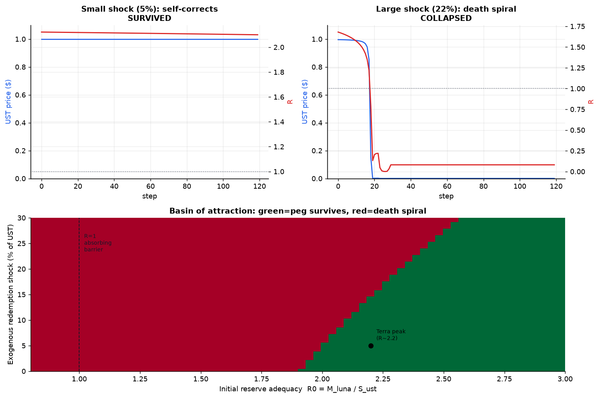
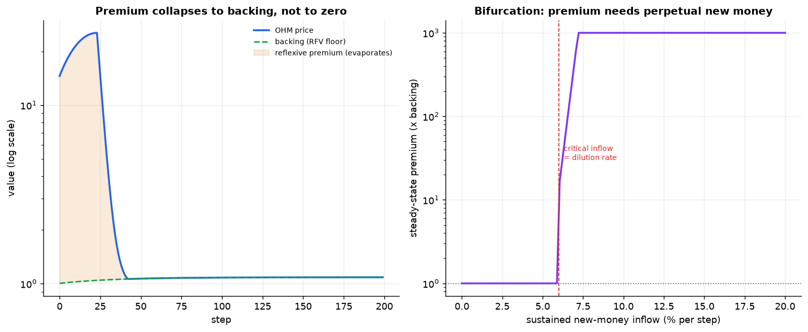
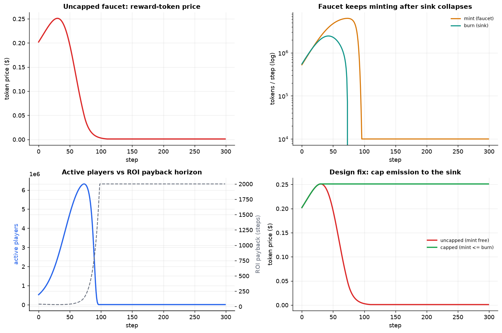
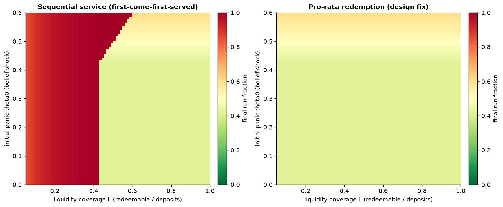
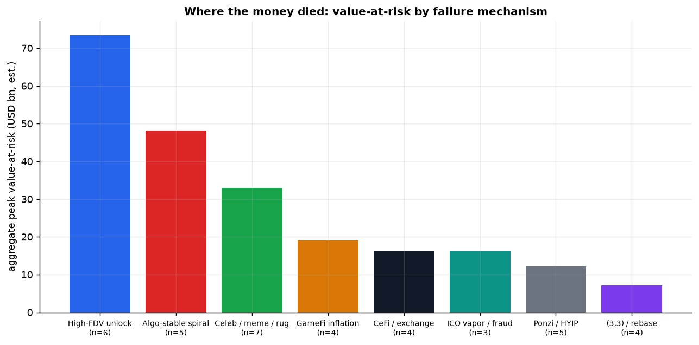
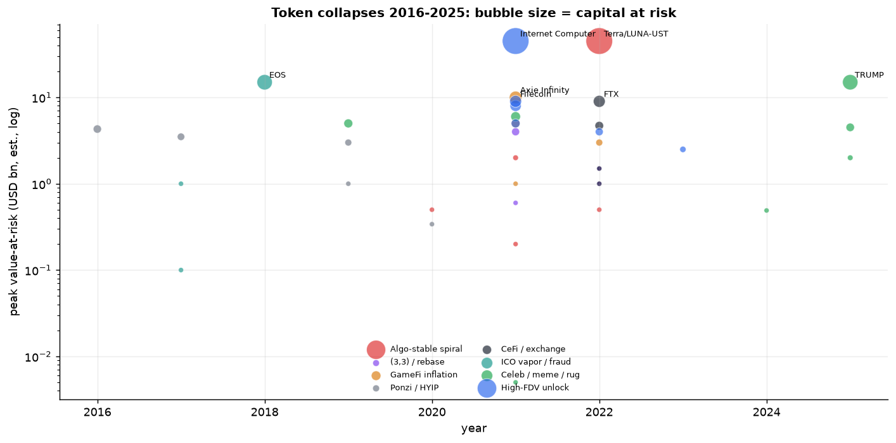

# 代币经济学死亡螺旋:博弈论 / 供需机制深度分析与失败 Skills 蒸馏

> [English](death-spiral-deep-analysis.md) | 🌐 **中文**
>
> 配套文档:[加密项目代币崩溃分析_2009-2026](加密项目代币崩溃分析_2009-2026.md)(案例编目层)。
> 本文是**机制层**:把"哪些项目崩了"升级为"它们在数学和博弈结构上为什么必然崩",并蒸馏成可复用的设计反模式(失败 Skills)。
> 定位:研究 / 设计参考,非投资建议。所有数字为量级估算,用于说明机制而非精确还原行情。

---

## 0. 方法论:三层分析框架

案例编目回答"**是什么**(What)";本文回答"**为什么必然**(Why-inevitable)"和"**怎么用**(How-to-apply)"。三层递进:

| 层级 | 问题 | 产物 | 现有文件 | 本文 |
|---|---|---|---|---|
| L1 现象层 | 哪些项目崩了、跌多少 | 案例库 | ✅ 50 案例 | 引用 |
| L2 机制层 | 供需/博弈结构为何注定崩 | 模型 + 定量解剖 | ❌ | ✅ 本文核心 |
| L3 知识层 | 如何在设计期识别与规避 | 反模式 Skills + 评分卡 | ❌ | ✅ 第 5–6 章 |

**关键判断**:死亡螺旋不是"运气差"或"运营失误",而是**机制内生的相变(phase transition)**。系统在某个临界参数之上是一个稳定吸引子,跨过临界点后跳到另一个吸引子(归零)。真正的分析目标是找到每类机制的**那个临界条件**。

---

## 1. 死亡螺旋的统一数学结构:反身性即正反馈

### 1.1 正常市场 vs 死亡螺旋:反馈符号相反

健康资产的供需是**负反馈(自稳定)**:

```
价格↑ → 需求↓ / 供给↑ → 价格回落   (负反馈,收敛到均衡)
```

死亡螺旋资产被机制改造成**正反馈(自强化)**:

```
价格↓ → 机制被迫增发/抛售/清算/赎回 → 供给↑ / 需求↓ → 价格↓↓   (正反馈,发散)
```

用一个统一的反身性方程刻画(Soros 反身性的离散化):

```
P(t+1) = P(t) · [1 + g(P(t), F(t))]
F(t+1) = F(t) · [1 + h(P(t))]        ← 关键:基本面 F 反过来依赖价格 P
```

- 在**健康项目**里,`∂h/∂P ≈ 0`:基本面(真实收入、用户效用)独立于币价。
- 在**死亡螺旋项目**里,`∂h/∂P > 0` 且足够大:基本面被设计成依赖币价(抵押品是自己、需求靠 APY、产出靠新人),于是 P 与 F 互相喂养。

**临界条件(本文反复出现的主线):** 当系统增益 `λ = (∂g/∂F)·(∂h/∂P) > 1` 时,均衡点从"稳定"变为"不稳定鞍点",任何向下扰动都被指数放大 → 死亡螺旋。**所有 A/B/C 类项目本质上都是把 λ 设计成了 >1。**

### 1.2 两类相变:连续型 vs 突变型

| 类型 | 动力学 | 价格轨迹 | 触发 | 代表 |
|---|---|---|---|---|
| **突变型(挤兑)** | 多重均衡 + 信念跳变 | 数小时~数天断崖 | 信心冲击(sunspot) | Terra、FTX、Celsius、Iron/TITAN |
| **连续型(阴跌)** | 单一不稳定均衡 + 持续抛压 | 数月~数年漏气 | 解锁/通胀按日兑现 | ICP、FIL、WLD、SLP、GST |

突变型是"信念协调失败";连续型是"供给曲线持续右移"。识别红旗的方式不同(见第 5 章)。

---

## 2. 四类核心博弈模型

死亡螺旋背后只有 4 个反复出现的博弈结构。掌握这 4 个,就能给任意新项目快速归类。

### 2.1 银行挤兑博弈(Diamond–Dybvig)——对应突变型

**结构**:协议承诺**即时、足额、先到先得**的赎回(顺序服务约束 sequential service),但底层资产是**非流动 / 期限错配 / 价格敏感**的。

存款人(持币人)是耐心型还是冲动型未知。支付博弈有**两个纯策略纳什均衡**:

| 均衡 | 所有人选择 | 结果 | 稳定性 |
|---|---|---|---|
| 好均衡 | 都不挤兑 | 协议正常,人人拿回本息 | 脆弱(靠信念维系) |
| 坏均衡 | 都挤兑 | 资产贱卖,后到者归零 | 一旦进入即锁死 |

**最优反应**:只要你**相信别人会跑**,你的占优策略就是**抢先跑**(先到先得 → 首动优势为正)。因此坏均衡是**自我实现**的——不需要基本面真的恶化,只需要信念跳变。

- **触发器(sunspot)**:CoinDesk 曝光 Alameda 资产负债表(FTX)、UST 在 Curve 池小幅脱锚(Terra)、暂停提现传闻(Celsius)。本身可能只是噪声,但点燃了协调失败。
- **设计病根**:① 顺序服务(先到先得)制造首动优势;② 期限/流动性错配;③ 即时赎回承诺。三者齐备 = 挤兑温床。
- **解药(把首动优势拿掉)**:赎回排队 / 锁定期、**pro-rata 按比例赔付而非先到先得**(消灭抢跑收益)、流动性覆盖率 > 可即时赎回负债、熔断器。

> 适用案例:FTX(FTT)、Celsius、Voyager、Iron Finance、Anchor 提现潮、所有 CeFi 借贷。

### 2.2 (3,3) 协调博弈——其实是伪装成合作的囚徒困境

OlympusDAO 的 "(3,3)" 把博弈矩阵画成"双方都 Stake 收益最高(3,3)",诱导合作。但它隐瞒了**支付的来源**:Stake 的高 APY 来自**增发**(稀释)+ **新债券买家注入国库**。真实的两人(老持有者 vs 边际参与者)博弈是:

```
                  对方 Stake        对方 Sell
   我 Stake      (账面+, 实值依赖新钱)   (我被稀释, 对方套现)  ← 我吃亏
   我 Sell       (我套现, 对方接盘)       (一起踩踏, premium→backing)
```

**关键**:APY 是名义的(rebase 给你更多枚),但你的**真实份额 = 你的代币 / 总供给**在被通胀稀释。只有当**新资金流入速度 ≥ 增发稀释速度**时 Stake 才划算。这等价于一个**有限期的击鼓传花**:

- **后向归纳(backward induction)**:存在"最后一个买家",他之后无人接盘 → 他不该买 → 倒数第二个预见到也不该买 → 理性下应从终点解开。现实中靠"更大的傻瓜"信念 + 无限期假设维持,直到**新资金增长率 < 赎回率**,音乐停止。
- **可观测的临界量**:`溢价 = 市价 / 国库背书价(backing/RFV)`。OHM 一度 >100×,信念反转后塌回 ~1×(注意:塌回的是**背书价,不是零**——这区别于算稳)。
- **解药**:让支付来自**真实协议收入**而非增发;降低"留下"对"退出"的优势(对称化);公开 backing,不鼓励溢价投机。

> 适用案例:OHM 及其全部分叉(Wonderland/TIME、Klima、Hector、数十个 "DAO")。

### 2.3 算法稳定币的铸赎套利与"吸收壁垒"——seigniorage 死亡螺旋

双币 mint/burn(Terra LUNA↔UST、Iron TITAN↔IRON、Basis、ESD)用套利维持锚定:

```
UST < $1 时:  烧掉 1 UST → 铸出 价值 $1 的 LUNA(再卖出)  → 减少 UST 供给, 拉回锚定
UST > $1 时:  烧掉 价值 $1 的 LUNA → 铸出 1 UST            → 增加 UST 供给
```

锚定在牛市自洽。致命点在**向下套利**:它把 UST 的抛压**转移成 LUNA 的增发抛压**。

**偿付能力条件(核心公式)**:设 UST 供给 `S`,LUNA 市值 `M = P_luna · Q_luna`。全额赎回需铸出价值 `S` 的 LUNA。系统能吸收的前提是:

```
储备充足率  R = M / S  ≫ 1
```

- 峰值时 LUNA 市值 ~$40B、UST ~$18B,`R ≈ 2.2`,**看起来安全**。
- 但 `M` 是**反身的**:赎回 → 增发并抛售 LUNA → `P_luna ↓` → `M ↓` → `R ↓` → 更恐慌 → 更多赎回。这正是 §1.1 的 `λ>1`。
- 当 `R → 1` 以下,**全额赎回在数学上不可能不把 LUNA 砸到零**。这是一个**吸收壁垒(absorbing barrier)**:一旦越过,无论后续如何博弈,终态唯一 = LUNA→0、UST 脱锚永久化。Terra 用了 ~72 小时从 `R≈2` 跌穿吸收壁垒。

**为什么熔断也救不了(Terra 的教训)**:即便有日铸造上限(Terra 当时约 $293M/日),限速只是**拉长**赎回,反而延长恐慌窗口、加剧脱锚预期——限速治标不治本,病根是**抵押品 = 反身性自身资产**。

- **解药**:① 抵押品**外生且与负债去相关**(USDC/ETH 等,而非自家币);② 超额抵押 + 储备充足率**熔断**(R 触线即暂停铸赎并切换到部分抵押模式);③ 放弃"算法 + 自身币"这一组合本身。

> 适用案例:Terra(LUNA/UST)、Iron Finance(TITAN/IRON)、Basis Cash、Empty Set Dollar。

### 2.4 解锁抛压的序贯 / 信息不对称博弈——对应连续型阴跌

低流通高 FDV 项目(ICP、FIL、WLD、APE)不是挤兑,而是**结构性供给曲线右移**的多期博弈。

**边际卖方–买方成本基不对称**(病根):

```
边际卖方 = 内部人(VC/团队), 成本基 ≈ $0 → 保留价(reservation price)≈ 0, 任何正价都愿卖
边际买方 = 二级散户, 成本基 = 市价         → 需要叙事/上涨预期才接盘
```

每次解锁都向市场**新增一批成本基≈0 的供给**。在需求不足以吸收前,清算价由**最低保留价的卖方**决定 → 价格被持续压向内部人的成本基附近。

**信息不对称叠加**:内部人知道真实解锁日历、真实留存、真实国库去向;散户只看到 K 线。这是一个**柠檬市场(Akerlof)**——理性散户应对"看不见的未来解锁"打折,但牛市叙事让他们系统性低估供给,直到解锁逐月兑现。

- **可观测临界量**:`初始流通比`、`未来 12 个月解锁量 / 当前流通量`、`FDV / 年化真实协议收入`。
- **解药**:① 拉长 + 线性化解锁(避免悬崖式 cliff);② 初始流通匹配真实需求深度;③ 内部人解锁**与可验证里程碑挂钩**而非纯时间;④ 信息对称化(链上可读的解锁日历)。

> 适用案例:ICP、Filecoin、Worldcoin、ApeCoin、大量 2024–25 "高 FDV 低流通"新币。

---

## 3. 供需机制定量解剖

博弈模型解释"信念与策略";供需框架解释"代币的价格物理"。

### 3.1 龙头–水槽框架(Faucet–Sink):通胀的第一性原理

任意代币经济都可拆成**产出(faucet)**与**回收(sink)**:

```
净通胀率 ≈ (faucet 流量 − sink 流量) / 流通量
价格压力 ∝ 净通胀率 − 真实需求增长率
```

- **健康**:`sink ≥ faucet`(销毁/锁定/真实消耗 ≥ 产出),或净通胀被真实需求增长吸收。
- **死亡螺旋(C 类)**:`faucet` 无上限(SLP/GST 无产出天花板),`sink` 完全依赖**新增用户**(繁殖/买鞋)。
  - 结构性缺陷:**sink 是反身的,faucet 不是**。增长停 → sink 塌 → 只剩 faucet → 恶性通胀 → 币价→0。
- **量化红旗**:`sink/faucet < 1` 且 `sink` 的需求来源 = 新增用户(而非存量用户的真实消耗)。

> SLP:无产出上限,sink(繁殖 Axie)只在 Axie 涨价(=新玩家入场)时有利可图 → 增长一停,sink 归零,SLP 单边增发 → -99.5%。STEPN GST 同构。

### 3.2 速度方程 MV = PQ:为什么"纯交换代币"天生贬值

货币数量论搬到代币:`M·V = P·Q`(M 流通量,V 流通速度,P 单价,Q 真实经济吞吐)。整理出代币单价:

```
P = (P·Q 真实使用价值) / (M · V)
```

- **velocity 问题**:若代币只是"用完即走"的交换媒介,V 很高 → P 被压低。许多 GameFi/utility 代币死于此:用户赚到立刻卖(高 V),无人长期持有。
- **质押锁定的悖论**:质押降低有效流通 M、降低 V → 短期托价。但锁定的代币是**未来抛压悬挂(staking overhang)**;维持锁定需要高 APY → 又回到 §2.2 的补贴/增发问题 → **反身**。即"用未来抛压换今天的低 velocity"。
- **解药**:让代币捕获真实价值(手续费销毁、ve 锁仓换治理/分润),把"交换媒介"升级为"生产性资产",从根上压低 V 并制造非反身的持有动机。

### 3.3 反身性需求曲线:斜率为正的"反常需求"

正常商品需求曲线向下(越贵买得越少)。死亡螺旋资产在投机区间需求曲线**向上倾斜**:

```
需求 = f(预期收益) , 而预期收益 ∝ 近期涨幅 (动量/APY)
⇒ 价格↑ → 预期收益↑ → 需求↑ → 价格↑   (右上发散)
⇒ 价格↓ → 预期收益↓ → 需求↓ → 价格↓   (左下发散)
```

- 这正是为什么这些资产**没有自然底部**:向下方向同样自我强化。需求不是来自效用(锚),而是来自**价格自身的二阶项**。
- **识别**:问一句——"如果币价归零,还有人需要这个代币吗?"。若答案是"否"(需求 100% 来自价格预期/APY/叙事),则需求曲线是反身的,无锚。

### 3.4 流通量 / FDV 与边际定价

承接 §2.4 的供给侧物理:

```
真实可交易供给 = 流通量 × (1 − 长期锁定比例)
价格 ≈ 边际买方愿付 / 边际卖方保留价 的撮合点
当 内部人成本基≈0 且解锁持续 ⇒ 撮合点被供给侧拖向 0
```

- **FDV/流通 缺口** = 隐藏的未来供给。`初始流通 5%、FDV $100 亿` 意味着 95% 的供给在头上,以接近零成本基等待释放。
- **健康基准(经验值,非铁律)**:警惕 `初始流通 < 10%`、`首年解锁 > 流通量的 50%`、`FDV / 年真实收入 > 100×`(无收入则不可估值,自动满级风险)。

---

## 4. 逐案定量解剖(选 5 个原型,套用上面的框架)

### 4.1 Terra / LUNA–UST(算稳吸收壁垒 + 银行挤兑 双杀)

- **需求引擎是补贴,不是效用**:UST 约 **75%** 沉淀在 Anchor 吃 **19.5%** 固定息。Anchor 收入(借款利息 + 抵押 staking 收益)远不足以覆盖该息,缺口由 yield reserve 补贴,reserve 靠 LFG 不断输血。→ UST 的"需求"本质是 §3.3 的反身性需求(来自补贴,不来自支付效用)。
- **吸收壁垒**:§2.3 的 `R = M_luna / S_ust`。峰值 `R≈2.2` 的"安全垫"因 `M_luna` 反身而瞬间蒸发。
- **挤兑触发**:UST 在 Curve/Anchor 提现潮中小幅脱锚(sunspot)→ §2.1 坏均衡锁定 → 套利铸出天量 LUNA → `R` 跌穿 1 → 吸收壁垒 → 一周 ~$400–600 亿归零,外溢 3AC→Celsius→Voyager→FTX(§4.4)。
- **三个 Skill 同时命中**:`反身性燃料`(抵押=自身币)+ `不可持续补贴需求`(Anchor)+ `银行挤兑结构`(即时赎回)。

### 4.2 OlympusDAO / OHM((3,3) 协调脆性)

- **博弈**:§2.2。APY 一度数千 %~百万 %,纯靠增发 + 新债券国库注入。
- **定量主线**:`溢价 = 市价 / backing`。投机者买的是溢价不是 backing;当新债券需求(新钱增速)< 增发稀释,溢价无锚 → 塌回 backing。
- **终态特征**:**塌到背书价(~$10–15)而非零**——因为国库里有真实(部分)资产托底。这是与算稳(§4.1 塌到零)的关键区别:OHM 的病是"溢价泡沫",不是"抵押品反身归零"。
- **外溢**:模型可分叉 → 数十个 (3,3) 克隆几乎全灭(Wonderland 还叠加 §5 的 `信任 / 透明度崩塌`:Sifu 前科曝光)。

### 4.3 Axie SLP / STEPN GST(无上限 faucet 通胀螺旋)

- **ROI 引擎**:玩家入场成本 `E`,日产 SLP。`回本天数 = E / (日产SLP × SLP价)`。新玩家只在回本天数可接受时入场。
- **faucet–sink 失衡**:§3.1。SLP 无产出上限(faucet 无顶);sink(繁殖)只在 Axie 涨价时有利 → sink 反身依赖增长。
- **相变**:增长停 → Axie 跌 → 繁殖停 → sink→0 → SLP 单边增发 → 恶性通胀 → SLP→$0.001(-99.5%)→ 回本天数→∞ → 玩家出逃(日活 270 万 → 5 万级)。
- **治理币的幸存悖论**:AXS 距 IEO($0.10)仍上涨——崩的是**产出币 / 经济体**,不是治理币。说明双代币里"把通胀塞给产出币"能保护治理币账面,但代价是经济体崩塌。

### 4.4 FTX / FTT(自印抵押品 + 银行挤兑)——传染的终点

- **自印抵押**:FTT 由 FTX 自己发行、流通薄、主要由关联方(Alameda)持有,却被当作抵押借真钱。这是 §2.3 反身性的 CeFi 版:抵押品价值与平台偿付能力**完全正相关**(相关系数≈1)。
- **挤兑**:§2.1。CoinDesk 曝光 Alameda 资产负债表(sunspot)+ 币安宣布抛售 FTT → 坏均衡 → 三天挤兑崩盘。
- **传染链证明了 §1 的系统性**:Terra(2022.5)→ 3AC → Celsius/Voyager → FTX(2022.11)。这些主体在**杠杆 / 抵押 / 做市层高度互联**,单点死亡螺旋升级为系统性事件。

### 4.5 ICP / Worldcoin(低流通高 FDV 连续阴跌)

- **无挤兑、纯供给物理**:§2.4 + §3.4。ICP 顶着明星光环高位上线,早期投资者解锁 → 边际卖方成本基≈0 → 多期被供给拖向地板,长期 -99%(距上线)。
- **WLD**:极低初始流通 + 巨量未来解锁,教科书式 `FDV/流通` 缺口,持续承压。
- **与突变型对照**:这里**没有 sunspot,没有协调失败**,只有"按解锁日历兑现的供给曲线右移"。所以红旗是**日历型**(解锁表)而非**信念型**(挤兑触发)。

---

### 4.6 配套数值仿真(可复现,校准自真实数据)

下面四张图由 `simulations/` 下的 Python 模型生成(`python run_all.py`),每个模型校准自真实崩盘参数,用来**可视化相变本身**——证明崩溃是机制内生(λ>1)、从现实参数即可达到,而非外生意外。完整说明见 [skills/.../references/simulations.md](skills/tokenomics-death-spiral-audit/references/simulations.md)。

**① 算稳吸收壁垒(Terra,校准 R₀≈2.2)**

同样 2.2× 的储备垫,5% 冲击自愈、22% 冲击死亡螺旋;相图显示 `R=1` 是吸收壁垒,Terra 峰值点(R≈2.2)离边界比直觉近得多——临界run仅约 14%。

**②(3,3)溢价解体(OHM,校准溢价 ≈13.8×)**

左:溢价蒸发,价格塌回**背书价而非零**(-92%);右:分岔图——稳态溢价在"新钱流入率 = 稀释率"处发生阶跃,低于该临界点必然解体。

**③ P2E 龙头-水槽通胀(Axie,校准 mint≈4×burn)**

繁荣→市场饱和→崩盘全周期;**同一需求冲击下**,无上限增发崩到近零,封顶(mint≤burn)版本存活——这就是设计解药的力量。

**④ 银行挤兑协调博弈(FTX/Celsius)**

顺序服务(先到先得)下约 51% 情形自我实现挤兑,低流动性区无条件崩;按比例赎回(设计解药)把挤兑盆地压缩到约 17%(仅极端恐慌)。

**宏观量化(38 个案例数据集,见 [data/case_dataset.csv](data/case_dataset.csv))**


价值毁灭最集中于**高 FDV 解锁 + 算稳 + CeFi**三类;崩盘在 2021–22 牛市顶与 2024–25 PolitiFi/meme 浪潮聚集。

---

## 5. 蒸馏:顶级失败 Skills(反模式目录)

> 这是给设计者的"避坑清单"。每个 Skill = **可在白皮书 / 合约阶段就检出的反模式**。格式:内核 → 博弈/数学结构 → 量化红旗(可观测阈值)→ 历史实例 → 设计解药。

### Skill #1 — 反身性燃料(Reflexive Collateral)
- **内核**:用代币自身(或与自身强相关的资产)作为储备/抵押。
- **结构**:§2.3。抵押品价值与被担保负债**正相关 → λ>1**,跌时抵押和负债同向恶化。
- **红旗**:储备资产与负债的相关系数 → 1;"用 A 币担保 A 币体系";自印抵押被关联方持有。
- **实例**:Terra(LUNA 担 UST)、FTX(FTT 当抵押)、Iron(TITAN 担 IRON)。
- **解药**:外生 + 去相关抵押(USDC/ETH);超额抵押 > 150%;储备充足率熔断。

### Skill #2 — 不可持续补贴需求(Subsidized Demand Engine)
- **内核**:核心需求来自补贴型高 APY,而非真实付费意愿。
- **结构**:§3.3 反身性需求。补贴 = 对未来需求的预支。
- **红旗**:协议**支出收益 > 协议真实收入**;yield reserve runway < 12 个月;> 60% 的代币需求集中在单一激励池。
- **实例**:Anchor 19.5%(撑起 75% 的 UST 需求)、OHM、几乎所有"流动性挖矿续命"项目。
- **解药**:Real Yield(收益 = 真实手续费);APY 随 reserve 动态下调;补贴退出时需求能软着陆。

### Skill #3 — 无上限龙头(Uncapped Faucet)
- **内核**:产出代币无硬性供应上限,sink 依赖新增用户。
- **结构**:§3.1。`sink/faucet < 1` 且 sink 反身。
- **红旗**:无供应硬顶;年增发 > 需求增长;sink 的需求来源 = 新用户而非存量真实消耗。
- **实例**:Axie SLP、STEPN GST、DeFi Kingdoms JEWEL。
- **解药**:产出动态绑定 sink(产出 ≤ 回收);硬性上限或 `burn ≥ mint`;让 sink 来自存量用户的真实效用消耗。

### Skill #4 —(3,3)协调脆性(Coordination-Fragile Staking)
- **内核**:把"全员锁仓"画成最优,但纳什均衡其实是全员退出。
- **结构**:§2.2 伪装的囚徒困境 + 后向归纳必然解开。
- **红旗**:APY 靠增发 / 新债券;`市价 / backing(RFV)> 3`;"留下"相对"退出"有强首动优势。
- **实例**:OHM 及全部 (3,3) 分叉(TIME、KLIMA …)。
- **解药**:收益来自真实营收;对称化退出;公开 backing,抑制溢价投机。

### Skill #5 — 银行挤兑结构(Sequential-Service Redemption)
- **内核**:即时足额先到先得赎回 + 期限/流动性错配。
- **结构**:§2.1 Diamond–Dybvig 多重均衡,首动优势制造自我实现的挤兑。
- **红旗**:承诺即时赎回但底层非流动;流动性覆盖率 < 可即时赎回负债;先到先得无排队。
- **实例**:FTX、Celsius、Voyager、Anchor 提现潮。
- **解药**:赎回排队 / 锁定期;**pro-rata 按比例赔付**消灭抢跑收益;流动性覆盖率 > 100%;熔断器。

### Skill #6 — 算稳吸收壁垒(Seigniorage Absorbing Barrier)
- **内核**:双币 mint/burn 把脱锚抛压转成储备币的无限增发。
- **结构**:§2.3。`R = M/S < 1` 是不可逆的吸收壁垒。
- **红旗**:无储备充足率熔断;脱锚时可无限增发;储备币与稳定币同体反身。
- **实例**:Terra、Iron、Basis、ESD。
- **解药**:储备充足率熔断 + 切换部分抵押;增发限速治标——**根治是放弃"算法 + 自身币"组合**。

### Skill #7 — 低流通高 FDV(Float–FDV Asymmetry)
- **内核**:边际卖方(内部人)成本基≈0,解锁持续把价格拖向地板。
- **结构**:§2.4 + §3.4。柠檬市场 + 供给曲线右移。
- **红旗**:初始流通 < 10%;首年解锁 > 流通量 50%;`FDV / 年真实收入 > 100×`(无收入则自动满级)。
- **实例**:ICP、Filecoin、Worldcoin、ApeCoin。
- **解药**:线性长解锁(去悬崖);流通匹配真实需求深度;内部人解锁与可验证里程碑挂钩;公开链上解锁日历。

### Skill #8 — 速度漏损(Velocity Leak)
- **内核**:纯交换型代币无价值捕获,高 velocity 持续压价。
- **结构**:§3.2。`P = 使用价值 / (M·V)`,V 高则 P 低;无非反身的持有动机。
- **红旗**:无销毁 / 无 ve 锁仓 / 无分润;"赚了即卖"用户占比高;持币中位时长极短。
- **实例**:大量 utility / GameFi 产出币。
- **解药**:fee burn、ve 锁仓换治理与分润,把代币从"交换媒介"升级为"生产性资产"。

### Skill #9 — 单点叙事 / 注意力依赖(Narrative-Only Demand)
- **内核**:需求 100% 来自叙事 / 名人 / meme,无任何现金流锚。
- **结构**:§3.3 极端形态,需求 = 注意力,注意力可被瞬间金融化也可瞬间蒸发。
- **红旗**:零收入;持仓极度集中;名人/团队持仓**未锁定**;合约含高税 / 不可卖 / 可增发后门。
- **实例**:LIBRA、MELANIA、TRUMP、HAWK、SQUID、SafeMoon。
- **解药**:本质投机,**设计上无法救**——此 Skill 的价值是"识别即规避",并作为监管/尽调红线。

### Skill #10 — 杠杆传染互联(Leverage Contagion)
- **内核**:多协议在抵押 / 做市 / 借贷层互联,单点死亡螺旋外溢成系统性。
- **结构**:§4.4。代币互为抵押 + 集中做市商 → 相关性在危机中 → 1。
- **红旗**:协议代币互为抵押;少数关联做市商提供主要流动性;跨协议同源风险敞口。
- **实例**:Terra → 3AC → Celsius/Voyager → FTX 连锁。
- **解药**:抵押品多元化 + 相关性压力测试;限制关联方做市集中度;隔离风险敞口。

---

## 6. 死亡螺旋风险评分卡(可操作工具)

把第 5 章的 Skill 转成一张设计期 / 尽调期可打分的表。每项 0(无)/1(部分)/2(显著),加权求和。

| # | 红旗 | 关联 Skill | 权重 | 自评 0/1/2 |
|---|---|---|---|---|
| 1 | 抵押品 / 储备与自身代币相关系数高 | #1 #6 | ×3 | |
| 2 | 核心需求来自补贴 APY 而非真实收入 | #2 | ×3 | |
| 3 | 产出代币无供应上限、sink 依赖新增用户 | #3 | ×2 | |
| 4 | 高 APY 靠增发,市价远高于 backing | #4 | ×2 | |
| 5 | 即时先到先得赎回 + 底层非流动 | #5 | ×3 | |
| 6 | 算法稳定币用自身币做储备、无熔断 | #6 | ×3 | |
| 7 | 初始流通 <10% 或首年解锁 >50% 流通 | #7 | ×2 | |
| 8 | 无价值捕获、velocity 高 | #8 | ×1 | |
| 9 | 需求纯叙事/名人,零现金流,持仓集中 | #9 | ×3 | |
| 10 | 与其他协议抵押/做市深度互联 | #10 | ×1 | |

**解读(加权满分 46):**
- **0–6**:结构性死亡螺旋风险低(仍可能有市场风险)。
- **7–15**:存在反身性设计,需明确临界条件与熔断。
- **16–28**:高危,具备 1–2 个 λ>1 引擎,牛市掩盖、熊市暴露。
- **≥29**:典型死亡螺旋模型,历史同类几乎全灭。

**使用方式**:任意打到 2 的项,直接回到对应 Skill 的"解药"重新设计;权重 ×3 的项命中 = 红线,优先级最高。

---

## 7. 给设计者的正向原则(反模式的镜像)

把 10 个 Skill 翻成"应该怎么做",得到健康代币经济的设计公理:

1. **基本面与币价解耦**:确保 `∂(基本面)/∂(币价) ≈ 0`,即 §1 的 `λ < 1`。这是所有原则的总纲。
2. **抵押外生且去相关**:储备绝不用自身币;压力测试相关性 → 1 的尾部场景。
3. **收益来自真实现金流**:Real Yield 优先;补贴必须有 runway 与软着陆路径。
4. **供需自平衡**:`sink ≥ faucet`,产出绑定真实消耗而非新增用户。
5. **消灭首动优势**:pro-rata 赔付、赎回排队、熔断器,从结构上让"抢跑"不划算。
6. **供给可预期且对称信息**:线性解锁、流通匹配需求、链上公开日历,消灭柠檬市场。
7. **价值捕获压低 velocity**:让长期持有由真实分润/治理驱动,而非靠 APY 贿赂。
8. **需求要有归零测试**:"若币价归零仍有人需要它吗?"答否 = 无锚,重新设计或不做。
9. **隔离传染**:限制跨协议抵押互联与做市集中度。
10. **透明可验证**:国库、抵押、解锁、团队持仓全部链上可读——不透明本身就是头号 sunspot 燃料。

---

### 附:本文与案例库的对应索引

| 失败 Skill | 案例库主要对应(编号见案例库) |
|---|---|
| #1 反身性燃料 | 1 Terra、21 FTX、2 Iron |
| #2 补贴需求 | 45 Anchor、5 OHM、33 HEX |
| #3 无上限龙头 | 9 Axie、10 STEPN、11 JEWEL |
| #4 (3,3) 脆性 | 5 OHM、6 Wonderland、7 Klima |
| #5 银行挤兑 | 21 FTX、22 Celsius、23 Voyager、2 Iron |
| #6 吸收壁垒 | 1 Terra、2 Iron、3 Basis、4 ESD |
| #7 低流通高 FDV | 41 ICP、42 FIL、44 WLD、43 APE |
| #8 速度漏损 | 9/10/11 产出币普遍 |
| #9 纯叙事 | 31 SQUID、32 SafeMoon、36 LIBRA、37/38 MELANIA/TRUMP、39 HAWK |
| #10 杠杆传染 | 1→21 的连锁、3AC/Celsius/Voyager |
